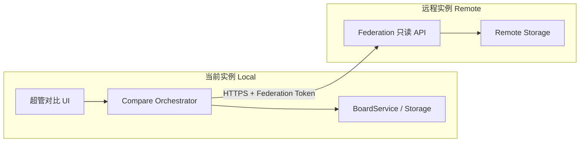
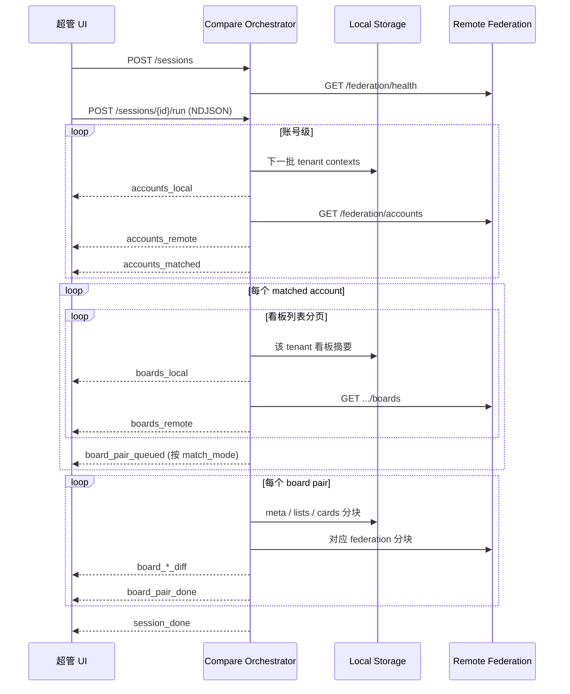

# 多平台看板对比功能设计

> 目标：超级管理员在**当前 BoardFlow 实例**与**另一台同源部署实例**之间，按「账号 → 看板」两级渐进拉取数据，对比看板差异。  
> 状态：**设计稿**（尚未实现）

---

## 1. 背景与目标

### 1.1 场景

- 本地开发：`http://127.0.0.1:9528`
- 线上实例：`https://board-flow-wheat.vercel.app`
- 超管需要确认：同一业务看板在两套环境是否一致（元数据、列表结构、卡片内容等）

### 1.2 核心约束

| 约束 | 说明 |
|------|------|
| 仅超管 | 本地对比入口与编排 API 均需 `require_super_admin` |
| 渐进拉取 | **禁止**一次性全量导出再对比；按账号分页，再按看板分页/分块 |
| 对比基准 | 默认以**当前实例（左侧 / local）**为基准，**远程 URL（右侧 / remote）**为对照 |
| 同源平台 | 远程必须是 BoardFlow，且版本/API 契约兼容（先通过 `/api/version` 探测） |

### 1.3 非目标（第一期不做）

- 自动修复 / 双向同步
- 跨平台（非 BoardFlow）对比
- 实时 WebSocket 推送（先用 NDJSON 流或分步 REST）
- 卡片大字段（canvas/mindmap/table）的像素级 diff

---

## 2. 总体架构



### 2.1 双端职责

| 端 | 新增模块 | 职责 |
|----|----------|------|
| **每台部署** | `Federation API` | 对外提供只读、分页的账号/看板/卡片数据 |
| **发起方（当前实例）** | `Compare Service` + UI | 创建对比会话、拉本地数据、请求远程、合并 diff、推送进度 |

本地读数据复用现有 `boardflow_storage._iter_tenant_contexts()` 与 `board_service`；远程通过 HTTP 调用对方 Federation API。

### 2.2 对比会话（Session）

一次对比任务对应一个 `session_id`（UUID），状态存 Redis（推荐）或进程内缓存 + TTL（开发期可接受）。

```text
jjob:boardflow:compare:session:{session_id}  →  JSON
```

会话记录：远程 base URL、token 摘要、匹配策略、进度游标、已累积结果摘要。

---

## 3. 安全与认证

### 3.1 本地

- 所有 `/api/compare/*`：`auth_service.require_super_admin()`
- 会话归属：仅创建者可查询/推进/删除

### 3.2 远程 Federation Token

环境变量（两台实例需**约定同一密钥**或双向配置）：

```text
FEDERATION_COMPARE_TOKEN=<随机长字符串>
FEDERATION_COMPARE_ENABLED=1   # 未开启则 Federation 路由返回 404
```

请求头：

```http
X-Federation-Token: <token>
```

校验失败返回 `401`；未启用返回 `404`（避免暴露功能面）。

### 3.3 远程 URL 校验

编排层对 `remote_base_url` 做规范化与白名单（可选）：

- 仅 `https://`（开发环境允许 `http://127.0.0.1`）
- 禁止内网段 SSRF（生产建议配置 `FEDERATION_ALLOWED_HOSTS`）
- 请求超时：连接 5s、读 30s；单看板结构块 60s

**不**在会话中持久化明文 token；仅保存「是否已验证」与创建时使用的 token 哈希（用于续拉）。

---

## 4. Federation API（远程只读，每台实例都需实现）

前缀建议：`/api/federation`（与业务 `/api/boards` 分离，便于网关禁用写操作）。

### 4.1 健康与版本

```http
GET /api/federation/health
```

响应：

```json
{
  "ok": true,
  "name": "BoardFlow",
  "version": "0.2.2",
  "federation": { "enabled": true, "api_version": 1 }
}
```

### 4.2 账号列表（第一级渐进）

「账号」= 租户上下文，与 `_iter_tenant_contexts` 一致：

| type | id | display_name |
|------|-----|--------------|
| `super_admin` | `super_admin` | 超级管理员 |
| `user` | `{user_id}` | 用户显示名 / 登录名 |

```http
GET /api/federation/accounts?cursor=&limit=20
```

响应：

```json
{
  "items": [
    {
      "tenant_type": "super_admin",
      "tenant_id": "super_admin",
      "display_name": "超级管理员",
      "board_count": 12
    },
    {
      "tenant_type": "user",
      "tenant_id": "3",
      "display_name": "张三",
      "board_count": 5
    }
  ],
  "next_cursor": "user:3",
  "done": false
}
```

实现要点：遍历 `list_users()` + 超管上下文；`board_count` 用现有 `list_boards` 计数逻辑，**不**加载 lists/cards。

### 4.3 看板摘要列表（第二级：按账号）

```http
GET /api/federation/accounts/{tenant_type}/{tenant_id}/boards?cursor=&limit=20
```

响应（与本地 `GET /api/boards` 摘要字段对齐）：

```json
{
  "tenant_type": "user",
  "tenant_id": "3",
  "items": [
    {
      "id": "7",
      "title": "迭代 Sprint 1",
      "organization": "研发中心",
      "status_id": "in_progress",
      "status": "进行中",
      "list_count": 4,
      "card_count": 18,
      "updated_at": "2026-07-01T08:00:00Z"
    }
  ],
  "next_cursor": "7",
  "done": false
}
```

### 4.4 看板结构（第三级：单看板，仍分块）

为避免一次 `GET /api/boards/<id>` 过大，拆为三档：

#### A. 元数据 + 统计

```http
GET /api/federation/accounts/{type}/{id}/boards/{board_id}/meta
```

```json
{
  "board": { "id": "7", "title": "...", "organization": "...", "status_id": "...", "updated_at": "..." },
  "list_count": 4,
  "card_count": 18
}
```

#### B. 列表结构（无卡片正文）

```http
GET /api/federation/accounts/{type}/{id}/boards/{board_id}/lists
```

```json
{
  "lists": [
    { "id": "1", "title": "待办", "position": 0, "card_count": 5 }
  ]
}
```

#### C. 卡片摘要（按列表分页）

```http
GET /api/federation/accounts/{type}/{id}/boards/{board_id}/lists/{list_id}/cards?cursor=&limit=50
```

```json
{
  "list_id": "1",
  "items": [
    {
      "id": "uuid-1",
      "title": "登录页改版",
      "type": "user_story",
      "position": 0,
      "comment_count": 2,
      "checklist_done": 1,
      "checklist_total": 3,
      "updated_at": "..."
    }
  ],
  "next_cursor": "uuid-1",
  "done": false
}
```

#### D. 卡片详情（可选第四级，按需）

```http
GET /api/federation/accounts/{type}/{id}/boards/{board_id}/cards/{card_id}/detail?fields=description,checklist,comments
```

大字段 `canvas_data` / `mindmap_data` / `table_data` 默认不返回；UI 勾选「深度对比」后再拉。

---

## 5. Compare API（本地编排，仅超管）

前缀：`/api/compare`

### 5.1 创建会话

```http
POST /api/compare/sessions
Content-Type: application/json

{
  "remote_base_url": "https://board-flow-wheat.vercel.app",
  "remote_token": "<FEDERATION_COMPARE_TOKEN>",
  "match_mode": "manual",
  "pairs": [
    {
      "local": { "tenant_type": "super_admin", "tenant_id": "super_admin", "board_id": "3" },
      "remote": { "tenant_type": "super_admin", "tenant_id": "super_admin", "board_id": "3" }
    }
  ],
  "options": {
    "compare_lists": true,
    "compare_cards": true,
    "compare_card_description": false,
    "compare_card_editors": false
  }
}
```

`match_mode` 枚举：

| 值 | 含义 |
|----|------|
| `manual` | 用户显式指定 board 对（列表页每行可选远程看板） |
| `by_title` | 同账号下按 `title + organization` 自动配对 |
| `by_id` | 同账号下 `board_id` 相同则配对（适合迁移校验） |

响应：

```json
{
  "session_id": "550e8400-e29b-41d4-a716-446655440000",
  "phase": "init",
  "remote_health": { "ok": true, "version": "0.2.2" }
}
```

创建时同步调用远程 `GET /api/federation/health`；失败则 400 并说明原因。

### 5.2 推进对比（渐进式核心）

两种等价形态，**推荐 NDJSON 流**（与 `clear-system` 一致）：

```http
POST /api/compare/sessions/{session_id}/run
Accept: application/x-ndjson
```

请求体（可选，用于从断点续跑）：

```json
{
  "from_phase": "accounts",
  "account_cursor_local": null,
  "account_cursor_remote": null
}
```

服务端 `generate()` 循环产出事件，每行一个 JSON：

#### 事件类型一览

| `step` | 含义 | 典型字段 |
|--------|------|----------|
| `session_started` | 开始 | `session_id`, `match_mode` |
| `accounts_local` | 拉取本地一批账号 | `items[]`, `cursor`, `done` |
| `accounts_remote` | 拉取远程一批账号 | 同上 |
| `accounts_matched` | 账号对齐结果 | `pairs[]`（local tenant ↔ remote tenant） |
| `boards_local` | 某账号下本地看板批次 | `tenant_*`, `items[]` |
| `boards_remote` | 某账号下远程看板批次 | 同上 |
| `board_pair_queued` | 确定要比的一对 | `local_board_id`, `remote_board_id` |
| `board_meta_diff` | 看板元数据 diff | `diff` |
| `board_lists_diff` | 列表结构 diff | `diff` |
| `board_cards_diff` | 某列表卡片 diff | `list_id`, `diff`, `progress` |
| `board_pair_done` | 单看板对完成 | `summary` |
| `phase_done` | 阶段完成 | `phase`, `percent` |
| `session_done` | 全部完成 | `totals` |
| `error` | 可恢复/致命错误 | `message`, `fatal` |

示例片段：

```json
{"step":"accounts_remote","items":[{"tenant_type":"user","tenant_id":"3","display_name":"张三","board_count":5}],"cursor":"user:3","done":false,"percent":8}
{"step":"board_meta_diff","pair_index":0,"local_board_id":"7","remote_board_id":"7","diff":{"status":"changed","fields":{"title":{"local":"Sprint 1","remote":"Sprint 1 "}}}}
{"step":"board_lists_diff","pair_index":0,"diff":{"added":[],"removed":[],"changed":[{"id":"2","field":"title","local":"进行中","remote":"Doing"}]}}
{"step":"session_done","totals":{"pairs":3,"boards_equal":1,"boards_changed":2,"errors":0},"percent":100,"done":true}
```

### 5.3 查询会话状态（断点续看）

```http
GET /api/compare/sessions/{session_id}
```

返回进度、已完成 diff 摘要、错误列表（不重复传全量 cards）。

### 5.4 获取已完成的对比结果

```http
GET /api/compare/sessions/{session_id}/results?pair_index=0&section=meta|lists|cards
```

支持分页；`section=cards` 时可加 `list_id`。

### 5.5 取消 / 删除

```http
DELETE /api/compare/sessions/{session_id}
```

---

## 6. 渐进拉取编排算法



### 6.1 账号对齐规则

| 模式 | 规则 |
|------|------|
| 默认 | `tenant_type` + `tenant_id` 精确匹配 |
| 超管 | 两侧均为 `super_admin` / `super_admin` |
| 用户 | `user_id` 相同；若远程无同 id，fallback 按 `display_name`（需 UI 确认） |

### 6.2 看板配对规则（`match_mode`）

- **manual**：仅对比 `pairs[]` 中声明的对
- **by_title**：`normalize(title) + normalize(organization)` 相同则配对；一对多时报 `warning`
- **by_id**：`board_id` 相同且同账号下存在则配对

未配对的看板在结果中标记 `only_local` / `only_remote`。

### 6.3 Diff 规范

统一 diff 结构（便于前端渲染）：

```json
{
  "status": "equal | changed | only_local | only_remote | error",
  "fields": {
    "title": { "local": "A", "remote": "B" }
  },
  "lists": {
    "added": [{ "id": "9", "title": "新列表" }],
    "removed": [{ "id": "2", "title": "旧列表" }],
    "changed": [{ "id": "1", "fields": { "title": { "local": "待办", "remote": "Todo" } } }]
  },
  "cards": {
    "by_list": {
      "1": {
        "added": [],
        "removed": [],
        "changed": [{ "id": "uuid", "fields": { "type": { "local": "task", "remote": "bug" } } }]
      }
    }
  }
}
```

卡片匹配键：优先 `id`（UUID 跨实例通常一致）；若仅迁移场景 id 不同，可选 `match_cards_by=title+position`（第二期）。

---

## 7. 前端交互设计

### 7.1 入口

- **设置 → 数据管理** 区域新增：**多平台看板对比**（仅超管可见）
- 可选：看板列表页工具栏「与远程对比」— 预填当前看板为 local pair

### 7.2 配置区

| 字段 | 说明 |
|------|------|
| 远程地址 | `https://...`，失焦时探测 health |
| 联邦 Token | 密码框，不落 localStorage |
| 匹配方式 | manual / by_title / by_id |
| 对比深度 | 元数据、列表、卡片摘要、描述、编辑器数据（勾选） |

### 7.3 列表页（核心）

双栏或表格：

| 本地看板 | 组织 | 远程看板（下拉/输入 ID） | 状态 |
|----------|------|--------------------------|------|
| Sprint 1 | 研发中心 | [选择远程看板 ▼] | 待对比 |
| 需求池 | 产品部 | 未配对 | only_local |

- 先 **拉取账号** → 展开账号节点 → **按账号拉看板**（展示进度条）
- `by_title` / `by_id` 可自动填充远程列
- 用户修正后点击 **开始对比**

### 7.4 进度与结果

- 顶部：总进度 `percent`、当前 `step` 文案（「正在对比 研发中心 / Sprint 1」）
- 流式事件驱动进度条（复用清理系统数据的 NDJSON 解析模式）
- 结果行：绿/黄/红徽章（equal / changed / missing）
- 点击进入 **对比详情抽屉**：元数据、列表并排、卡片 diff 表

### 7.5 前端 API 封装建议

```javascript
// static/js/compare.js（新文件）
async function runCompareSession(sessionId, onEvent) {
  const res = await fetch(`/api/compare/sessions/${sessionId}/run`, {
    method: 'POST',
    headers: { Accept: 'application/x-ndjson' },
  });
  const reader = res.body.getReader();
  // 按行 parse JSON → onEvent(event)
}
```

---

## 8. 后端模块划分

| 文件 | 职责 |
|------|------|
| `services/federation_service.py` | 本地 Federation 只读查询（供远程调用） |
| `routes/federation.py` 或 `routes/api.py` 段 | Federation 路由 + token 校验 |
| `services/compare_service.py` | 会话管理、远程 HTTP 客户端、diff 计算 |
| `services/compare_diff.py` | 纯函数：meta/lists/cards normalize + diff |
| `services/compare_remote_client.py` | `requests` 封装：health、accounts、boards… |
| `routes/api.py` | `/api/compare/*` 路由 |
| `static/js/compare.js` | 对比 UI |
| `templates/index.html` | 对比面板 DOM |
| `static/css/main.css` | 对比页样式 |

### 8.1 复用现有能力

- 本地账号遍历：`BoardFlowStorage._iter_tenant_contexts()`
- 本地看板摘要：`board_service.list_boards()` 需在指定 `tenant_ctx` 下执行（可扩展 `list_boards_for_tenant(ctx)`）
- 本地看板详情：抽取 `get_board_detail()` 为可注入 tenant 的版本
- 流式响应：对齐 `iter_clear_all_system_data()` + `application/x-ndjson`

### 8.2 远程 HTTP 客户端伪代码

```python
class CompareRemoteClient:
    def __init__(self, base_url: str, token: str): ...

    def health(self) -> dict: ...
    def iter_accounts(self, *, cursor=None, limit=20): ...
    def iter_boards(self, tenant_type, tenant_id, *, cursor=None, limit=20): ...
    def get_board_meta(self, tenant_type, tenant_id, board_id) -> dict: ...
    def get_board_lists(self, ...) -> dict: ...
    def iter_list_cards(self, ..., list_id, *, cursor=None, limit=50): ...
```

---

## 9. 配置项汇总

| 变量 | 默认 | 说明 |
|------|------|------|
| `FEDERATION_COMPARE_ENABLED` | `0` | 是否暴露 Federation API |
| `FEDERATION_COMPARE_TOKEN` | 空 | 共享只读令牌 |
| `FEDERATION_ALLOWED_HOSTS` | 空 | 逗号分隔，发起方允许连接的远程 host |
| `COMPARE_SESSION_TTL_SEC` | `3600` | 会话 Redis 过期 |
| `COMPARE_REMOTE_TIMEOUT_SEC` | `30` | 远程读超时 |
| `COMPARE_ACCOUNTS_PAGE_SIZE` | `20` | 账号分页 |
| `COMPARE_BOARDS_PAGE_SIZE` | `20` | 看板分页 |
| `COMPARE_CARDS_PAGE_SIZE` | `50` | 卡片分页 |

---

## 10. 分阶段实施计划

### Phase 0 — 契约与开关（1–2 天）

- [x] `GET /api/federation/health`
- [x] 环境变量与 token 中间件
- [x] 文档与版本字段 `federation.api_version: 1`

### Phase 1 — 渐进拉取（3–5 天）

- [x] Federation：`accounts`、`boards` 分页
- [x] Compare：`POST /sessions`、`POST /sessions/{id}/run`（仅到 `boards_*` 事件）
- [x] 前端：配置远程地址 + 账号/看板树形进度

### Phase 2 — 看板 diff（3–5 天）

- [x] Federation：`meta`、`lists`、`cards` 分块
- [x] `compare_diff.py` + `board_*_diff` 事件
- [x] 前端：对比结果列表 + 元数据/列表详情

### Phase 3 — 体验与加固（2–3 天）

- [x] 断点续跑、`GET /results` 分页
- [x] SSRF 白名单、错误重试、会话 TTL
- [x] 卡片描述/勾选深度对比（可选）

---

## 11. 错误处理

| 场景 | 行为 |
|------|------|
| 远程 token 错误 | `session` 创建失败，提示 401 |
| 远程超时 | 当前 board pair 标记 `error`，`fatal: false`，继续下一对 |
| 版本不兼容 | `api_version` 不一致时警告，仍尝试对比；字段缺失记 `unknown` |
| 本地看板不存在 | 该 pair `only_remote` |
| 用户取消 | `DELETE session`，中断 NDJSON 生成器 |

---

## 12. 测试建议

| 类型 | 内容 |
|------|------|
| 单元 | `compare_diff` 对 equal/changed/added/removed 用例 |
| 集成 | mock 远程 HTTP，跑完 `run` 事件序列 |
| 手工 | 本地 9528 ↔ 线上 vercel，manual 一对看板 |
| 安全 | 无 token / 错误 token / SSRF 内网地址 |

---

## 13. 与现有 API 的关系

| 现有 | 对比方案 |
|------|----------|
| `GET /api/boards` | 仅当前登录租户；对比需按 tenant 枚举，走 Federation/内部 API |
| `GET /api/boards/<id>` | 全量过大；对比改用分块 Federation |
| `export/system` | 全量备份，**不**用于对比流水线 |
| `clear-system` NDJSON | **复用**流式模式与前端解析经验 |

---

## 14. 附录：手动模式请求示例

```bash
# 1. 创建会话
curl -X POST http://127.0.0.1:9528/api/compare/sessions \
  -H "Cookie: session=..." \
  -H "Content-Type: application/json" \
  -d '{
    "remote_base_url": "https://board-flow-wheat.vercel.app",
    "remote_token": "secret",
    "match_mode": "manual",
    "pairs": [{
      "local": {"tenant_type":"super_admin","tenant_id":"super_admin","board_id":"1"},
      "remote": {"tenant_type":"super_admin","tenant_id":"super_admin","board_id":"1"}
    }]
  }'

# 2. 流式对比
curl -N -X POST http://127.0.0.1:9528/api/compare/sessions/{id}/run \
  -H "Cookie: session=..." \
  -H "Accept: application/x-ndjson"
```

---

**文档版本**：1.0  
**最后更新**：2026-07-06  
**关联文档**：`doc/redis-data-structure.md`
