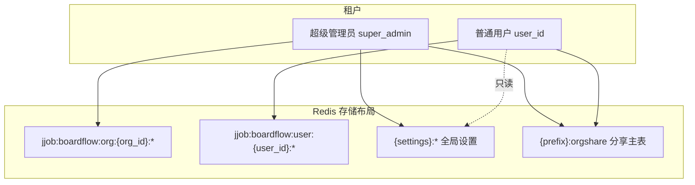
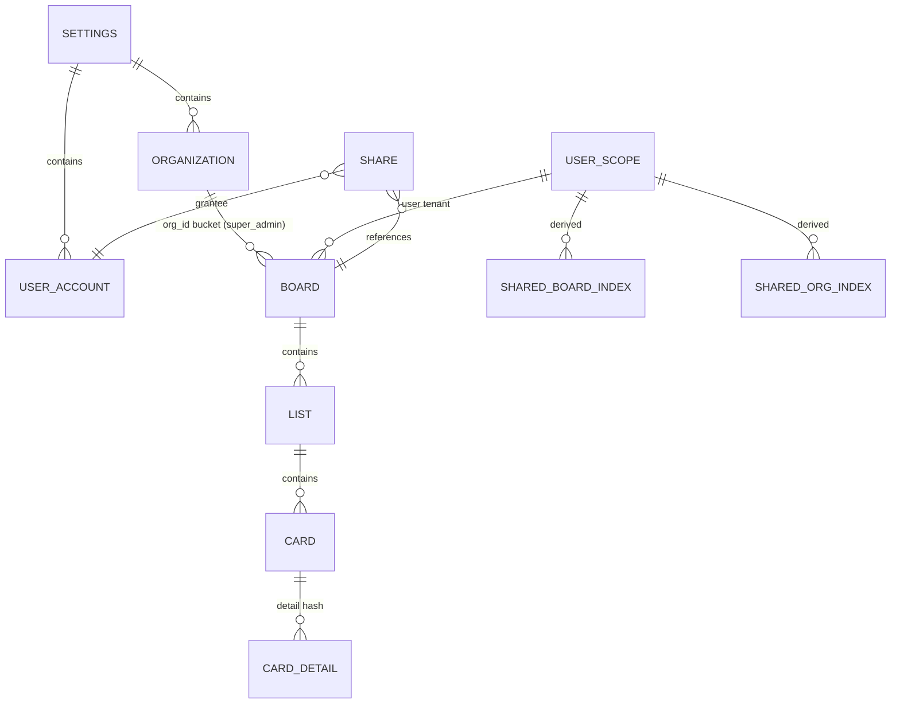

# BoardFlow Redis 数据结构设计

本文说明 BoardFlow 在 Redis 中的键命名、多租户隔离、看板实体分层存储，以及分享索引的设计。实现代码主要分布在：

- `services/tenant_keys.py` — 租户与用户命名空间
- `services/org_keys.py` — 超管组织命名空间与实体分组
- `services/boardflow_storage.py` — 多租户读写门面
- `services/storage.py` — Redis 底层读写与 settings Hash
- `services/share_service.py` — 分享与受赠方索引同步

---

## 1. 环境变量与命名空间

| 变量 | 默认值 | 含义 |
|------|--------|------|
| `REDIS_URL` | — | Redis 连接串 |
| `REDIS_KEY_PREFIX` | `jjob:boardflow` | 全局前缀，用于分享表等 |
| `REDIS_SETTINGS_KEY` | `jjob:boardflow:settings` | 系统设置根键 |

固定命名空间（不随 `REDIS_KEY_PREFIX` 改变）：

| 常量 | 值 | 用途 |
|------|-----|------|
| `ORG_NAMESPACE` | `jjob:boardflow:org` | 超级管理员看板数据（按组织分桶） |
| `USER_NAMESPACE` | `jjob:boardflow:user` | 普通用户自建看板数据 |

下文用 `{prefix}` = `REDIS_KEY_PREFIX`，`{settings}` = `REDIS_SETTINGS_KEY`。

---

## 2. 多租户模型

BoardFlow 将「谁的数据」与「数据落在哪」分开：



| 租户类型 | `tenant_ctx.type` | 数据根路径 | 说明 |
|----------|-------------------|------------|------|
| 超级管理员 | `super_admin` | `jjob:boardflow:org:{org_id}` | 按**组织 ID** 分多个 Redis 子树；组织列表来自 settings |
| 普通用户 | `user` | `jjob:boardflow:user:{user_id}` | 单用户一棵完整看板树，与组织名无关 |

超级管理员账号通过环境变量 `SUPER_ADMIN_USERNAME` / `SUPER_ADMIN_PASSWORD` 认证，**不**写入 `{settings}:users`。

---

## 3. 看板实体分层（组织域与用户域通用）

无论超管组织域还是用户域，看板、列表、卡片都采用同一套层级键（`scope_*` 与 `org_*` 函数对称）：

```
{scope_root}:boards                              Hash  field=board_id   value=看板 JSON
{scope_root}:meta                                Hash  自增 ID（next_board_id 等）
{scope_root}:boards:{board_id}:lists             Hash  field=list_id    value=列表 JSON
{scope_root}:boards:{board_id}:lists:{list_id}:cards   Hash  field=card_id  value=卡片核心 JSON
{scope_root}:boards:{board_id}:lists:{list_id}:state   Hash  field=card_id  value=排序/状态 JSON
{scope_root}:boards:{board_id}:lists:{list_id}:detail:{card_id}  Hash  field=字段名  value=JSON 片段
```

其中 `{scope_root}` 为：

- 超管：`jjob:boardflow:org:{org_id}`（`org_root(org_id)`）
- 用户：`jjob:boardflow:user:{user_id}`（`user_scope_root(user_id)`）

### 3.1 卡片字段拆分

单张卡片在 Redis 中拆成三部分（`split_card_record` / `merge_card_record`）：

| 部分 | 存储位置 | 典型字段 |
|------|----------|----------|
| **core** | `:cards` Hash | `id`, `title`, `type`, `board_id`, `list_id`, `description` 等 |
| **state** | `:state` Hash | `position`, `updated_at` |
| **detail** | `:detail:{card_id}` Hash | `comments`, `checklist`, `canvas_data`, `mindmap_data`, `table_data`, `description_data` |

大字段（画布、脑图、表格等）放在 detail Hash，避免拖慢列表扫描。

### 3.2 超管组织 ID 解析

看板 JSON 中的 `organization` 字段（组织**名称**）映射到 `org_id`（`resolve_org_id`）：

| 组织名称 | 解析结果 |
|----------|----------|
| 空 / `个人看板` | `org_0`（`PERSONAL_ORG_ID`） |
| 与 settings 中组织名匹配 | 使用该组织的 `id` |
| 未登记的新名称 | `org_custom_{sha1前8位}` |

因此超管下同一组织名的看板会落在同一 `org_id` 子树下；自定义组织名即使未写入 settings 也会生成独立 `org_custom_*` 桶。

---

## 4. 超级管理员：组织域键一览

前缀：`jjob:boardflow:org:{org_id}`

| Redis 键 | 类型 | 说明 |
|----------|------|------|
| `:meta` | Hash | `next_board_id`, `next_list_id`, `next_card_id` 等 |
| `:boards` | Hash | 该组织下所有看板 |
| `:boards:{board_id}:lists` | Hash | 看板下的列表（大列） |
| `:boards:{board_id}:lists:{list_id}:cards` | Hash | 列表下卡片核心数据 |
| `:boards:{board_id}:lists:{list_id}:state` | Hash | 卡片排序与轻量状态 |
| `:boards:{board_id}:lists:{list_id}:detail:{card_id}` | Hash | 卡片详情分字段存储 |

系统启动或扫描时，除 settings 里登记的组织外，还会发现 Redis 中已存在的 `jjob:boardflow:org:*:meta` 键（含 `org_custom_*`）。

---

## 5. 普通用户：用户域键一览

前缀：`jjob:boardflow:user:{user_id}`

| Redis 键 | 类型 | 说明 |
|----------|------|------|
| `:boards` | Hash | 用户自建看板 |
| `:meta` | Hash | 用户域自增 ID |
| `:boards:{board_id}:lists` | Hash | 列表 |
| `:boards:...:cards` / `:state` / `:detail:{card_id}` | Hash | 同组织域结构 |
| `:shared_boards` | Hash | **分享看板快速索引**（见第 7 节） |
| `:shared_org_index` | Hash | **分享看板按组织分组索引**（侧边栏「共享项目」） |
| `:organizations` | Hash | **用户自建项目组织**（field=org_id，各用户独立） |

用户域是**扁平单根**：不按 `org_id` 再分子目录，组织名仅存在看板 JSON 的 `organization` 字段中。

---

## 6. 全局设置（`{settings}`）

系统级配置拆成多个 Hash，避免单键过大：

| Redis 键 | 类型 | field 含义 | value |
|----------|------|------------|-------|
| `{settings}:card_types` | Hash | 类型 id | 卡片类型 JSON |
| `{settings}:board_statuses` | Hash | 状态 id | 看板状态 JSON |
| `{settings}:organizations` | Hash | 组织 id | 组织 JSON（**仅超级管理员**所属组织） |
| `{settings}:editable_fonts` | Hash | 字体作用域 id（如 `board_title`） | 字体配置 JSON 字符串 |
| `{settings}:collaboration` | Hash | field=`config` | 多人协作全局配置 JSON |
| `{settings}:users` | Hash | 用户 id | 用户账号 JSON（密码哈希等） |

`collaboration` 默认含：`enabled`、`card_optimistic_lock`、`editor_exclusive_lock`、`lease_ttl_sec`（300）、`heartbeat_interval_sec`（60）、`locked_editors`。

卡片 **core** 含整数 `revision`，每次成功写入自增，供 PATCH/PUT 乐观锁校验。

运行时编辑锁（非 settings）：

```
{prefix}:edit_lock:{tenant_type}:{tenant_id}:{board_id}:{card_id}:{editor_key}
```

值为持锁用户 JSON（`token`、`user_id`、`display_name` 等），TTL = `lease_ttl_sec`。

组织归属：

- **超级管理员**：组织写入 `{settings}:organizations`，看板按 `org_id` 分桶存储
- **普通用户**：组织写入 `jjob:boardflow:user:{user_id}:organizations`，各用户互不可见、互不影响

普通用户在设置页「我的项目」中维护个人组织；超管在「所属组织」中维护全局组织。

---

## 7. 分享系统

### 7.1 分享主表

| Redis 键 | 类型 | 说明 |
|----------|------|------|
| `{prefix}:orgshare` | Hash | field=`share_id`，value=分享记录 JSON |

单条分享记录字段示例：

```json
{
  "id": "share_abc123",
  "owner_tenant_type": "user",
  "owner_tenant_id": "u001",
  "board_id": "3",
  "grantee_user_id": "u002",
  "permissions": { "view": true, "edit": false },
  "created_at": "...",
  "updated_at": "..."
}
```

分享**不复制**看板数据；受赠方通过 `owner_tenant_*` + `board_id` 读取物主租户下的真实数据。

### 7.2 受赠方索引（冗余加速）

写入/更新/删除分享后，对受赠方用户调用 `sync_grantee_share_index`，重建两个 Hash：

**`jjob:boardflow:user:{grantee_id}:shared_boards`**

| field | value |
|-------|-------|
| `shared_board_{hash10}` | 单条分享看板索引 JSON（含 `board_id`, `organization`, `owner_*`, `permissions` 等） |

**`jjob:boardflow:user:{grantee_id}:shared_org_index`**

| field | value |
|-------|-------|
| `shared_org_{hash10}` | 按「物主 + 组织」聚合的索引（含 `board_ids`, `owner_display_name` 等） |

索引 entry 的 id 由 `sha1(owner_type:owner_id:board_id|org_id)` 前 10 位派生，保证稳定可去重。

> 旧版曾在 `{settings}:user:{id}:shared_boards` 等路径存索引，已迁移到用户域下；启动时会清理 legacy 键。

---

## 8. 逻辑关系总览



---

## 9. 全量备份（v2 系统包）逻辑结构

`export_full_snapshot()` 不直接 dump Redis 键，而是组装逻辑快照：

```json
{
  "settings": { "card_types", "board_statuses", "organizations", "editable_fonts" },
  "super_admin_tenant": { "boards", "lists", "cards", "meta" },
  "users": [
    {
      "profile": { "id", "username", "display_name", ... },
      "tenant": { "boards", "lists", "cards", "meta" },
      "organizations": [ ... ],
      "shared_boards": [ ... ],
      "shared_org_index": [ ... ]
    }
  ],
  "shares": [ ... ]
}
```

导入时按上述结构写回各 Redis 键，并对每个用户重新同步分享索引。

---

## 10. 旧版 / 兼容键（迁移用）

以下键**不应在新环境手动写入**；代码读取时做迁移或清理：

| 键模式 | 说明 |
|--------|------|
| `{prefix}:state` | 旧版整包 JSON |
| `{prefix}:boards` / `:lists` / `:cards` | 旧版扁平结构 |
| `{settings}`（String） | 旧版 settings 整包 |
| `{settings}:user:{id}:organizations` | 旧版用户组织 |
| `{settings}:user:{id}:shared_*` | 旧版分享索引 |
| `jjob:boardflow:user:{id}:share_inbox` | 旧版分享收件箱 |
| `jjob:boardflow:org:{id}:projects` | 旧版看板键名 |
| `jjob:boardflow:org:{id}:boards:{list_id}:cards` | 旧版列表下无 board_id 层 |

---

## 11. 运维与排查

### 11.1 常用 SCAN 模式

```bash
# 所有组织桶
SCAN 0 MATCH jjob:boardflow:org:*

# 某用户全部键
SCAN 0 MATCH jjob:boardflow:user:<user_id>*

# 系统设置
SCAN 0 MATCH jjob:boardflow:settings:*

# 分享主表
HGETALL jjob:boardflow:orgshare
```

### 11.2 清理全系统数据

设置页「清理所有系统数据」会按顺序删除：用户域、组织域、`orgshare`、`{settings}:users` 及 legacy 键，并重置 settings 与超管空租户。**不可恢复**，建议先导出 v2 系统全量包。

### 11.3 与本地 JSON 模式的关系

`STORAGE_BACKEND=json` 时，超管数据落在 `data/boards.json`，用户租户落在 `data/tenants/{user_id}.json`，侧车文件 `users.json` / `shares.json` / `settings.json` 对应 Redis 中的 settings 与分享。键设计文档描述的是 **Redis 模式**下的权威布局。

---

## 12. 相关源码索引

| 主题 | 文件 |
|------|------|
| 组织键名 | `services/org_keys.py` |
| 租户 / 用户 / 分享键名 | `services/tenant_keys.py` |
| Redis 读写与 settings Hash | `services/storage.py` |
| 多租户门面、全量导入导出 | `services/boardflow_storage.py` |
| 分享与索引同步 | `services/share_service.py` |
| v2 备份包 | `services/data_transfer.py` |
